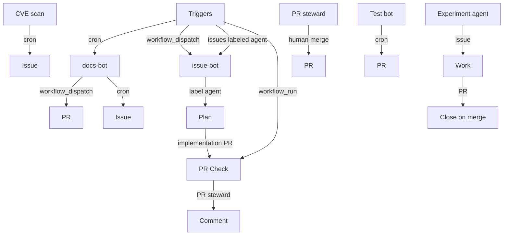

# Scheduled repository agents

Automation that runs **at least once per week** (staggered cron) or on demand. Same pattern as [test-bot](../scripts/test-bot/README.md): GitHub Actions + scripts + `gh` CLI.

## Overview

| Agent | Workflow | Schedule (UTC) | Secret(s) | Opens |
|-------|----------|----------------|-----------|--------|
| [Docs bot](../scripts/docs-bot/README.md) | [`docs-bot.yml`](../.github/workflows/docs-bot.yml) | Mon 08:00 | `OPENAI_API_KEY` | PR |
| [CVE scan](../scripts/cve-scan/README.md) | [`cve-scan.yml`](../.github/workflows/cve-scan.yml) | Wed 08:00 | — | Issue (if HIGH/CRITICAL) |
| [Issue worker](../scripts/issue-bot/README.md) | [`issue-bot.yml`](../.github/workflows/issue-bot.yml) | Fri 08:00 + label `agent` | `OPENAI_API_KEY` | Plan + PR |
| [PR steward](../scripts/pr-bot/README.md) | [`pr-bot.yml`](../.github/workflows/pr-bot.yml) | Sat 08:00 + after PR Check | `OPENAI_API_KEY` (optional) | Comment |
| [Test bot](../scripts/test-bot/README.md) | [`test-bot.yml`](../.github/workflows/test-bot.yml) | Sun 07:00 | `OPENAI_API_KEY` | PR |
| [Experiment agent](../scripts/experiment-agent/README.md) | [`experiment-agent.yml`](../.github/workflows/experiment-agent.yml) | Odd days 08:00 | `OPENAI_API_KEY` | Issue + PR |

Manual run: **Actions** → pick workflow → **Run workflow**.

## Architecture

## Agent reference

### Docs bot

- **Purpose:** Sync the apps catalog table in [`apps/README.md`](../apps/README.md).
- **Script:** [`scripts/docs-bot/`](../scripts/docs-bot/README.md) · **Workflow:** [`.github/workflows/docs-bot.yml`](../.github/workflows/docs-bot.yml)
- **Schedule:** Monday 08:00 UTC (`0 8 * * 1`) · **Trigger:** `workflow_dispatch`
- **Secrets:** `OPENAI_API_KEY` (optional polish) · **Opens:** PR on `docs-bot/<timestamp>`

### CVE scan

- **Purpose:** Trivy filesystem scan; open or update a GitHub issue on HIGH/CRITICAL findings.
- **Script:** [`scripts/cve-scan/`](../scripts/cve-scan/README.md) · **Workflow:** [`.github/workflows/cve-scan.yml`](../.github/workflows/cve-scan.yml)
- **Schedule:** Wednesday 08:00 UTC (`0 8 * * 3`) · **Trigger:** `workflow_dispatch`
- **Secrets:** none (`GITHUB_TOKEN` only) · **Opens:** issue `[CVE scan]` (deduped)

### Issue worker

- **Purpose:** Triage issues labeled [`agent`](https://github.com/eduardocerqueira/AI-sandbox/issues?q=is%3Aissue+label%3Aagent) — plan comment, then LLM implementation on `issue-bot/<n>-<slug>` and a PR.
- **Script:** [`scripts/issue-bot/`](../scripts/issue-bot/README.md) · **Workflow:** [`.github/workflows/issue-bot.yml`](../.github/workflows/issue-bot.yml)
- **Schedule:** Friday 08:00 UTC (`0 8 * * 5`) · **Trigger:** `issues` labeled `agent`, `workflow_dispatch` (optional `plan_only`)
- **Secrets:** `OPENAI_API_KEY`; optional `ISSUE_BOT_GH_TOKEN` for `gh pr create` · **Opens:** issue comments + PR (`Closes #n` on merge)

### PR steward

- **Purpose:** Post a review checklist on PRs — checks status, diff summary, optional OpenAI notes. **No auto-merge.**
- **Script:** [`scripts/pr-bot/`](../scripts/pr-bot/README.md) · **Workflow:** [`.github/workflows/pr-bot.yml`](../.github/workflows/pr-bot.yml)
- **Schedule:** Saturday 08:00 UTC (`0 8 * * 6`) · **Trigger:** after **PR Check** completes (`workflow_run`), `workflow_dispatch`
- **Secrets:** `OPENAI_API_KEY` (optional summary) · **Opens:** PR comment (`<!-- pr-bot:steward -->`)

### Test bot

- **Purpose:** Find source files without tests in CI-covered apps, generate tests via LLM, verify with app test suites, open a PR.
- **Script:** [`scripts/test-bot/`](../scripts/test-bot/README.md) · **Workflow:** [`.github/workflows/test-bot.yml`](../.github/workflows/test-bot.yml)
- **Schedule:** Sunday 07:00 UTC (`0 7 * * 0`) · **Trigger:** `workflow_dispatch`
- **Secrets:** `OPENAI_API_KEY`; optional `TEST_BOT_GH_TOKEN` for `gh pr create` · **Opens:** PR on `test-bot/<timestamp>`

### Experiment agent

- **Purpose:** Pick a learning topic from [`docs/`](.), open a proposal issue, add research or scaffold a Python app, open a PR.
- **Script:** [`scripts/experiment-agent/`](../scripts/experiment-agent/README.md) · **Workflow:** [`.github/workflows/experiment-agent.yml`](../.github/workflows/experiment-agent.yml)
- **Schedule:** Odd calendar days 08:00 UTC (`0 8 1-31/2 * *`) · **Trigger:** `workflow_dispatch`
- **Secrets:** `OPENAI_API_KEY` · **Opens:** issue + PR; issue closed on merge via [`experiment-agent-close.yml`](../.github/workflows/experiment-agent-close.yml)

## Issue → PR workflow (agent issues)

| Step | Who |
|------|-----|
| 1. Open issue + label `agent` | You |
| 2. Plan comment | **Issue worker** |
| 3. Branch + implementation PR | **Issue worker** (v2) |
| 4. PR Check + steward comment | **PR Check**, **PR steward** |
| 5. Merge | You (closes issue via `Closes #n`) |

Use workflow input **`plan_only`** to get a plan without opening a PR. **Experiment agent** and **test-bot** open their own PRs on a schedule without an `agent` issue.

## Safety defaults

- **No auto-merge** in PR steward v1 — human merge only.
- **Issue worker** only picks issues with label [`agent`](https://github.com/eduardocerqueira/ai-sandbox/issues?q=is%3Aissue+label%3Aagent) (you add it).
- **CVE scan** opens at most one tracking issue per run; skips if an open CVE issue already exists.
- Bots use `github-actions[bot]` for git commits.

## Setup checklist

1. Enable Actions on the repo.
2. Add repository secret **`OPENAI_API_KEY`** (docs, test, issue bots; optional for PR steward).
3. For issue bot: create label **`agent`** and open issues you want automated (keep scope small).
4. Optional: branch protection requiring **PR Check** before merge.

## Workflow approval (Copilot / bot PRs)

GitHub blocks workflows that use **repository secrets** on `pull_request` from untrusted authors until a maintainer approves. This repo avoids that for PR steward by:

1. **`workflow_run`** — PR steward runs after PR Check on the default-branch workflow (secrets allowed).
2. **[`approve-pending-actions.yml`](../.github/workflows/approve-pending-actions.yml)** — auto-approves other runs stuck on `action_required` when GitHub allows the API.

Fork PRs: in **Settings → Actions → General**, you can set fork workflows to not require approval; the auto-approve workflow covers many cases after merge to `main`.

## Adding a new agent

1. Add `scripts/<name>/` with README and entrypoint.
2. Add `.github/workflows/<name>.yml` with `schedule` + `workflow_dispatch`.
3. Document here, in this file’s overview table, and add a row to [README.md](../README.md) Documentation table if user-facing.

## What triggers on a new PR?

| Workflow | Runs when a PR opens? |
|----------|------------------------|
| **PR Check** | Yes — every `pull_request` |
| **PR steward** | Yes — after **PR Check** completes (`workflow_run`; no approval gate) |
| **Auto-approve** | Yes — unblocks other workflows awaiting maintainer on PR open/update |
| test-bot, docs-bot, CVE scan, issue-bot, experiment-agent | No — cron or manual only |

Bots do not chain automatically (test-bot does not wake docs-bot). Use schedules or run workflows manually.

## Experiment agent lifecycle

1. **Proposal** — opens an issue (`experiment-agent` + `agent-in-progress`) describing the topic from [docs/](.).
2. **Work** — adds `docs/experiments/*.md` or scaffolds `apps/python/<slug>/`, runs `pytest` for code.
3. **PR** — branch `experiment-agent/…`, body includes `Closes #<issue>`.
4. **Review** — PR Check + PR steward (same as other PRs).
5. **Close** — [`experiment-agent-close.yml`](../.github/workflows/experiment-agent-close.yml) closes the issue when the PR merges.

## Limits (honest)

| Goal | v1 support | Notes |
|------|------------|--------|
| Update all docs from code | Partial | Docs bot syncs app catalog tables; deep rewrites need review |
| CVE → issue | Yes | Trivy filesystem scan; dev dependency noise possible |
| Fix issues end-to-end | Best-effort (v2) | Issue bot opens PR; keep issues scoped to docs/small changes |
| Review + merge PR | Review only | Comments and checklist; **you** merge |

Hugging Face Jobs can run batch Python but do not replace GitHub for issues/PRs — keep orchestration in Actions.
